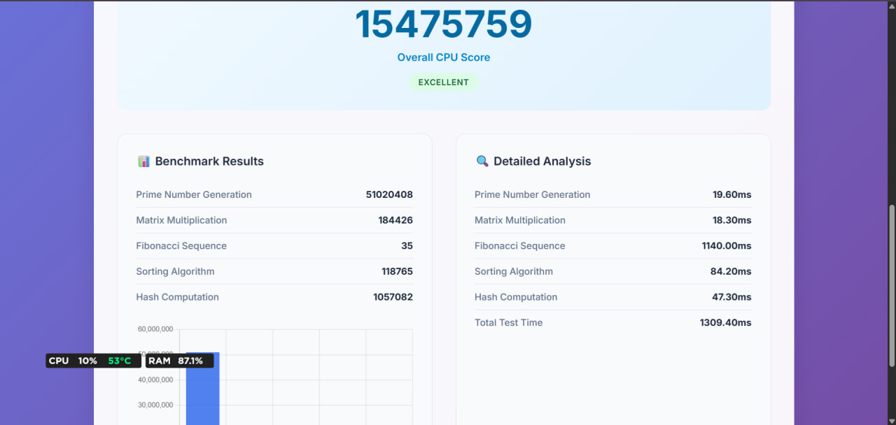

# ⚡ Browser Benchmark

A futuristic and open sourcebenchmarking web app that tests performance by calculating **all prime numbers up to 5,000,000**.  
It gives you a **CPU score**, **performance rating**, and even lets you **download a PDF report** of your results.

🔗 Live Repo: [Benchmark on GitHub](https://github.com/kirubelm1/Benchmark)

---
## 📸 Preview
  

---
## 🚀 Features
- Calculates prime numbers up to **5,000,000** using the **Sieve of Eratosthenes**.
- Measures **time taken** and computes a **CPU performance score**.
- Rates your CPU as:
  - 🐢 Slow  
  - ⚖️ Medium  
  - ⚡ Fast  
  - 🚀 Superfast
- Displays:
  - First 20 primes
  - Last prime found
  - Total primes calculated
- Exports results into a **stylish PDF report**.

---

## 🛠️ How to Use 
1. Clone this repo:
   ```bash
   git clone https://github.com/kirubelm1/Benchmark.git
